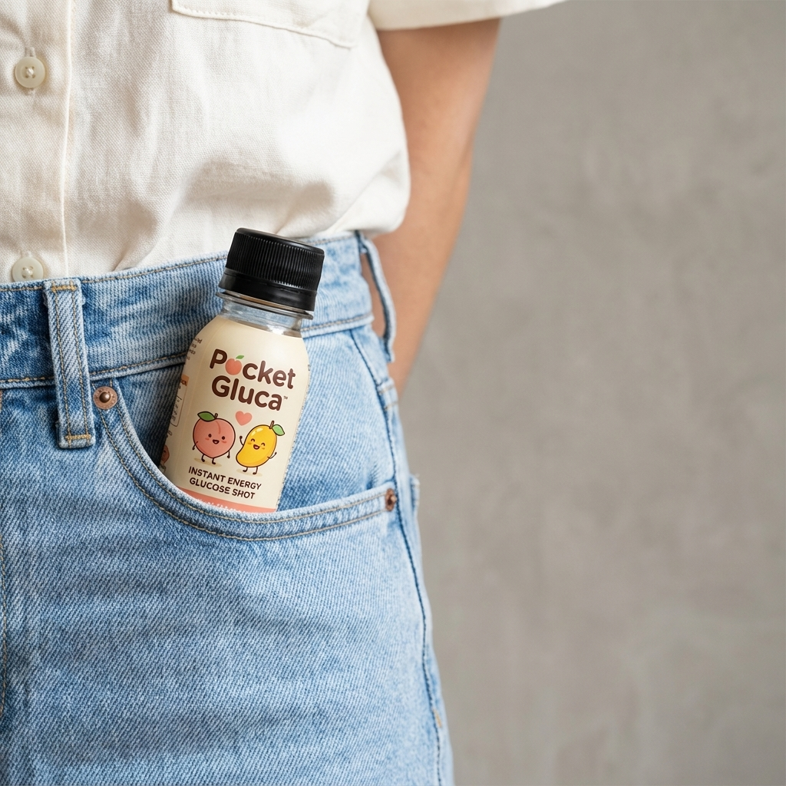

# PocketGluca Redesign 🚀

A premium, clinically-aligned web experience for **PocketGluca** – the 15g precision liquid glucose shot for hypoglycemia management. This project focuses on high-end aesthetics, interactive product visualization, and clear clinical messaging using modern web technologies.



## ✨ Key Features

- **Premium Design System:**
  - "Clinical Luxury" aesthetic blending clean medical whites with vibrant brand oranges.
  - Custom typography using *Outfit* (Display) and *Inter* (Body).
  - Glassmorphism & sophisticated gradient overlays.

- **Interactive 3D Experiences:**
  - **3D Flavor Carousel:** A rotating, interactive gallery of product flavors using CSS 3D transforms.
  - **Digital Precision Gauges:** Animated "Smart Monitor" and "Digital Scale" visuals to represent the exact 15g dosage.
  - **Animated Comparisons:** Dynamic bar charts comparing absorption speed vs. traditional tablets.

- **Modern Tech Stack:**
  - **Framework:** React + Vite (Fast HMR)
  - **Styling:** Tailwind CSS (Utility-first, responsive)
  - **Animations:** Framer Motion (Complex orchestrations, layout transitions)
  - **Icons:** Lucide React

## 🛠️ Installation & Setup

1.  **Clone the repository:**
    ```bash
    git clone https://github.com/yourusername/pocketgluca-redesign.git
    cd pocketgluca-redesign
    ```

2.  **Install dependencies:**
    ```bash
    npm install
    ```

3.  **Run the development server:**
    ```bash
    npm run dev
    ```
    Open [http://localhost:5173](http://localhost:5173) in your browser.

## 📂 Project Structure

- `src/pages/Home.jsx` - Main landing page containing the Hero, 3D Carousel, Features, and CTA sections.
- `src/components/layout` - Reusable layout components (Navbar, Footer).
- `src/index.css` - Global styles, Tailwind directives, and custom animations.
- `tailwind.config.js` - Color palette ('brand', 'cream', 'peach', etc.), fonts, and theme extensions.

## 🎨 Design Philosophy

The redesign aims to shift the brand perception from "clinical necessity" to "lifestyle essential."
- **Visuals:** High-contrast, large imagery, floating elements.
- **Motion:** Smooth, physics-based transitions that feel "expensive."
- **Messaging:** Confident, concise, and focused on speed ("Instant Energy") and precision ("Exact Dose").

---
*Built for PocketGluca 2026 redesign initiative.*
